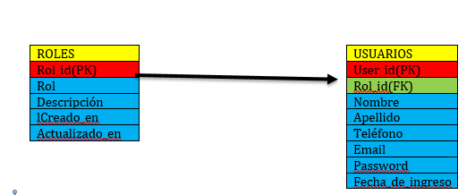
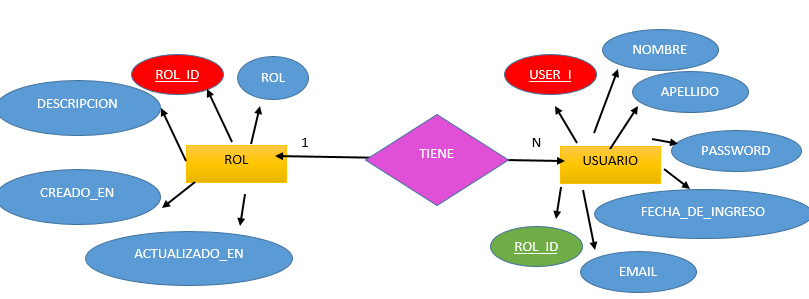

# 📘 PROYECTO: SISTEMA DE ADMINISTRACIÓN DE USUARIOS Y ROLES

## 📊 TABLAS

🔽 **Visualizar imagen de las tablas**  


## 🧩 DIAGRAMA ENTIDAD - RELACIÓN

🔽 **Visualizar diagrama entidad-relación**  


---

## 📌 Descripción General

Este proyecto está desarrollado en **PHP** bajo el patrón de arquitectura **MVC (Modelo-Vista-Controlador)**. Su objetivo principal es permitir la gestión de usuarios, roles y la administración dinámica de tablas desde un panel centralizado.

---

## 🗂️ Estructura del Proyecto (MVC)

```plaintext
PROYECTO_VERSION1/
│
├── assets/
│   ├── config/
│   │   └── bloqueados.json
│   ├── css/
│   │   └── styles.css
│   ├── images/
│   │   ├── DIAGRAMA_ENTIDAD_RELACION.png
│   │   ├── TABLA.png
│   │   └── inconR.jpeg
│   └── js/
│       ├── create_table.js
│       └── table_list.js
│
├── controllers/
│   ├── rol/
│   │   ├── rol_create.php
│   │   ├── rol_delete.php
│   │   ├── rol_list.php
│   │   └── rol_update.php
│   ├── table/
│   │   ├── bloquear_tablas.php
│   │   ├── tabla_create.php
│   │   └── tabla_list.php
│   ├── user/
│   │   ├── user_create.php
│   │   ├── user_delete.php
│   │   ├── user_list.php
│   │   └── user_update.php
│   ├── login_close.php
│   └── loginV.php
│
├── models/
│   ├── Connection.php
│   ├── Role.php
│   ├── Table.php
│   └── User.php
│
├── views/
│   ├── menu/
│   │   ├── menu_general.php
│   │   └── menu_usuario.php
│   ├── rol/
│   │   ├── rol_create_form.php
│   │   ├── rol_delete_form.php
│   │   ├── rol_update_form.php
│   │   └── role_list.php
│   ├── tabla/
│   │   ├── bloquear_tablas.php
│   │   ├── create_table.php
│   │   ├── search_table.php
│   │   └── table_list_form.php
│   ├── user/
│   │   ├── user_create_form.php
│   │   ├── user_delete_form.php
│   │   ├── user_list_form.php
│   │   └── user_update_form.php
│   ├── login_form.php
│   └── 404.php
│
├── backup.sql
├── index.php
└── README.md

---

## ✅ Funcionalidades principales

- 🔐 Inicio y cierre de sesión con validación de credenciales.
- 👥 CRUD completo para gestión de usuarios.
- 🛡️ CRUD completo para gestión de roles.
- 📊 Visualización de todas las tablas creadas.
- 🏗️ Creación dinámica de nuevas tablas con campos personalizados.
- 🔒 Protección de tablas restringidas mediante `bloqueados.json`.

---

## ▶️ ¿Cómo ejecutar el proyecto?

1. Importa `backup.sql` en tu gestor de bases de datos (p. ej. Laragon).
2. Asegúrate de configurar correctamente el archivo `models/Connection.php` con tus credenciales de conexión.
3. Abre el archivo `index.php` desde tu navegador web.

### 🔑 Credenciales de prueba

| Rol       | Email              | Contraseña |
|-----------|--------------------|------------|
| Admin     | r@gmail.com        | c1         |
| Empleado  | paul@mail.com      | c2         |

---

## ⚙️ Requisitos

- PHP 7.4 o superior  
- MySQL  
- Navegador moderno (Chrome, Firefox, Edge, etc.)

---

## 👨‍💻 Autor

**Ronaldinho Rodríguez Romero**
